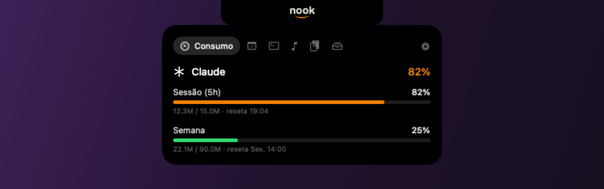

<p align="center">
  
</p>

# Nook

Uma central de controle no notch do Mac.

O recorte no topo da tela é espaço morto: ninguém coloca nada ali, e ele fica o
dia inteiro ocupando pixels sem fazer nada. O Nook usa esse espaço para o que
você checaria de qualquer jeito, várias vezes por dia, abrindo e fechando
janelas.

Em repouso ele não desenha nada. Passe o mouse sobre o recorte e um painel desce
de dentro dele.

Em monitor sem notch físico o recorte é desenhado, com a mesma largura do de um
MacBook, e tudo funciona igual. Ali cabe a marca: a palavra com um sorriso por
baixo do *oo*. Num MacBook o recorte é a câmera, não tem pixel, e a marca não
aparece.

## O que ele mostra

O painel tem abas. Uma coisa por vez, escolhida por você.

**Consumo.** Quanto sobrou do seu plano do Claude na janela de 5 horas, na
semana e nos créditos, com os números oficiais da Anthropic, não estimativa. E
a cota da MiniMax, se você usa. Mais consumo por dia e por mês como referência.

Quando um limite passa de 80%, o sorriso da marca acende em laranja. É o único
momento em que o Nook aparece sem você pedir, e a única coisa que usa laranja.

**Agenda.** O que vem a seguir nas próximas 36 horas, lendo o Calendário do
sistema, então enxerga iCloud, Google e Exchange juntos. O que está acontecendo
agora fica em destaque e continua visível até terminar. Clique numa linha para
entrar na chamada, ou para abrir o compromisso no Calendário quando não houver
link.

**Sessões.** Quais agentes de IA estão rodando, o que cada um está fazendo e há
quanto tempo está ocupado ou parado. O título é o que a própria IA deu à
conversa, não o nome da pasta. Clique numa sessão para trazer o terminal dela
para frente.

Cobre Claude Code e opencode ao mesmo tempo.

**Tocando.** Capa, faixa, álbum, barra de progresso e controles de anterior,
pausa e próxima. Spotify e app Música.

**Transferência.** O que você copiou recentemente, com busca visual e um clique
para colar de volta. Senhas e chaves de API são descartadas na entrada, e o
resto expira sozinho em oito horas. Detalhes de como isso funciona estão na
[documentação técnica](TECHNICAL.md#área-de-transferência).

**Prateleira.** Capturas de tela recentes e arquivos que você largou ali,
prontos para arrastar de volta para qualquer lugar. Serve para aquele arquivo
que você precisa daqui a dois minutos e não quer decidir onde guardar.

**Notion.** Cole um link, aperte enter, e ele vai para o seu banco no Notion já
classificado como vídeo, tweet, repositório, fórum ou artigo, deduzido do
endereço. Para quando você acha algo bom no meio do dia e não quer perder o
fluxo salvando na mão.

## Como se comporta

Nunca rouba o foco. Clicar no painel não tira o cursor de onde você estava
digitando.

Fecha sozinho quando o mouse sai, com um atraso curto para não piscar enquanto
você percorre as abas.

Os números que mais importam, os limites do plano e o estado das sessões,
atualizam em cerca de 50 milissegundos. O resto acompanha um ciclo de 15
segundos.

Escolha quais abas quer, e em que ordem, editando uma lista no arquivo de
configuração.

## Onde os dados ficam

Tudo é lido da sua própria máquina. As únicas coisas que saem dela são a
consulta de cota à MiniMax e o download da capa do álbum, além do que você
mesmo escolher mandar para o Notion.

Nada é enviado para nenhum servidor do Nook, porque não existe servidor do Nook.

## Instalação rápida

```bash
./tools/make-signing-identity.sh     # certificado local, uma vez só
./make-app.sh && open dist/Nook.app  # compila e abre
./tools/install-statusline.sh        # liga os números reais do plano Claude
```

macOS 14 ou superior, Xcode 15 ou superior.

O passo do certificado evita que o macOS peça todas as permissões de novo a
cada atualização. O da statusline é o que traz os limites oficiais do plano:
sem ele o Nook cai numa estimativa que erra feio.

Chaves da MiniMax e do Notion são opcionais e ficam guardadas fora do
repositório. O passo a passo está na
[documentação técnica](TECHNICAL.md#instalação).

## Por dentro

Fontes de dados, permissões do macOS, decisões de arquitetura e as armadilhas
já pagas estão em [TECHNICAL.md](TECHNICAL.md).

## Licença

MIT. Veja [LICENSE](LICENSE).
